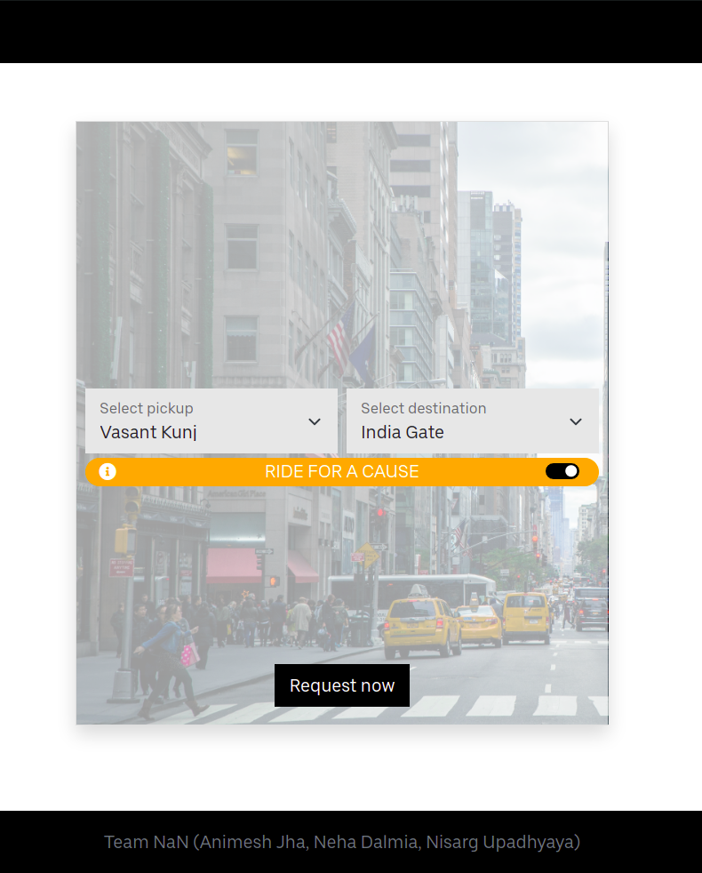
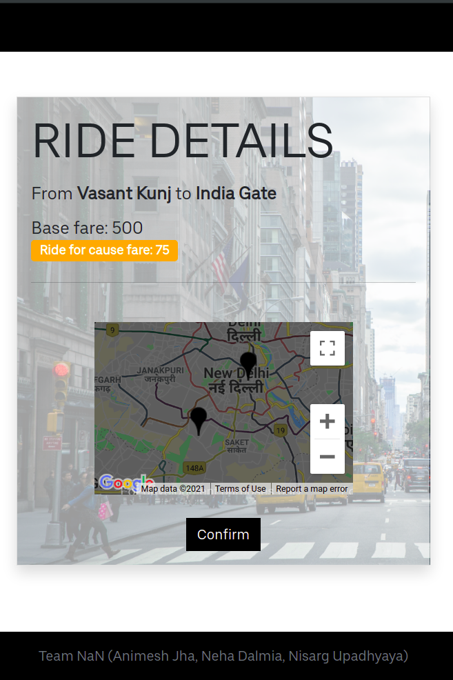
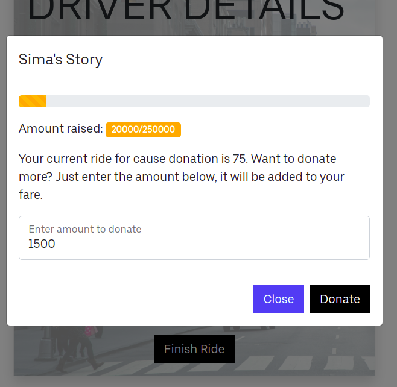
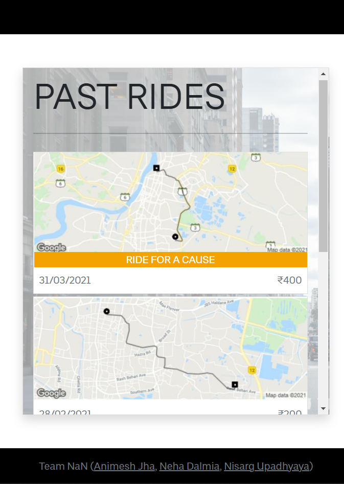

# UberHackTag

This repository contains the demo made by Team NaN for UberHackTag-2021

&nbsp;

<b>Fig. (a)</b>. Home Page 

&nbsp;

&nbsp;

<b>Fig. (b)</b>. Ride Details 

&nbsp;

&nbsp;

<b>Fig. (c)</b>. Donate More 

&nbsp;

&nbsp;

<b>Fig. (d)</b>. Past Rides 

&nbsp;
